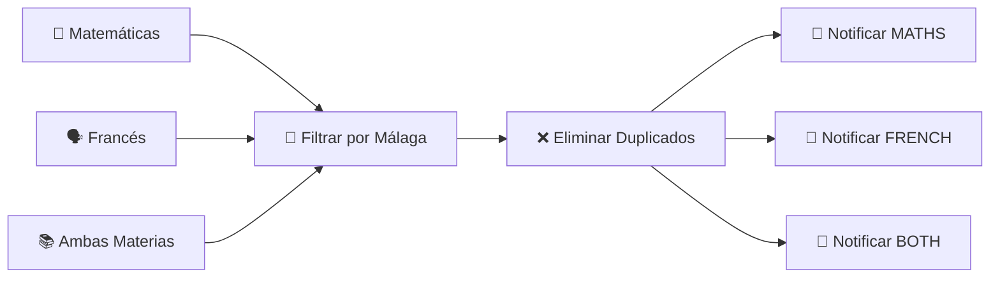

# 🚀 Java Coding Challenges - Dual Retos


Este proyecto contiene dos retos de programación en Java que ponen a prueba:
- 📌 Eficiencia en el manejo de estructuras de datos.
- ⚡ Diseño y optimización de algoritmos.
- ✅ Desarrollo de pruebas unitarias con JUnit 5.

## 📚 Tabla de Contenidos
1. [🔍 Reto 1: Validación de Revista](#reto-1---validación-de-revista)
2. [📢 Reto 2: Sistema de Notificaciones](#reto-2---sistema-de-notificaciones)
3. [⚙️ Instalación](#instalación)
4. [🧪 Ejecución de Pruebas](#ejecución-de-pruebas)

---

## 🔍 Reto 1 - Validación de Revista

### 📌 Descripción
Dado un conjunto de caracteres en una revista, se debe determinar si es posible formar una nota utilizando únicamente esos caracteres.

### 🛠️ Implementación
```java
boolean canWrite = Magazine.canWrite("nota", "revista");
System.out.println(canWrite); // true o false
```

### 🧪 Pruebas Unitarias
El algoritmo es probado con diferentes combinaciones, incluyendo: 
- ✔️ Casos con caracteres repetidos.
- ✔️ Sensibilidad a mayúsculas/minúsculas.
- ✔️ Manejo de caracteres especiales y Unicode.
- ✔️ Pruebas de rendimiento con grandes volúmenes de datos.

---

## 📢 Reto 2 - Sistema de Notificaciones Académicas
### 🎯 Problema
Desarrollar un sistema que notifique a estudiantes de Málaga afectados por cancelaciones de clases en Matemáticas y Francés, asegurando que:

- 📌 Solo se notifiquen estudiantes de Málaga.
- 🏷️ Se eviten notificaciones duplicadas a quienes están en ambas asignaturas.
- 📊 Se estructuren los datos en grupos de afectados por cada materia.

### 🧠 Solución Implementada
El sistema filtra y clasifica los estudiantes de la siguiente manera:-


### ⚙️ Instalación
Clona el repositorio:

```bash
git clone https://github.com/Mozzesdev/prueba-java.git
cd prueba-java
```
Asegúrate de tener Java 17+ y Maven 3.8+ instalados.

### Compila el proyecto:

```bash
mvn clean install
```

### 🧪 Ejecución de Pruebas
Para ejecutar las pruebas unitarias:

```bash
mvn test
```

Los resultados detallados aparecerán en la terminal y en el directorio target/surefire-reports.
